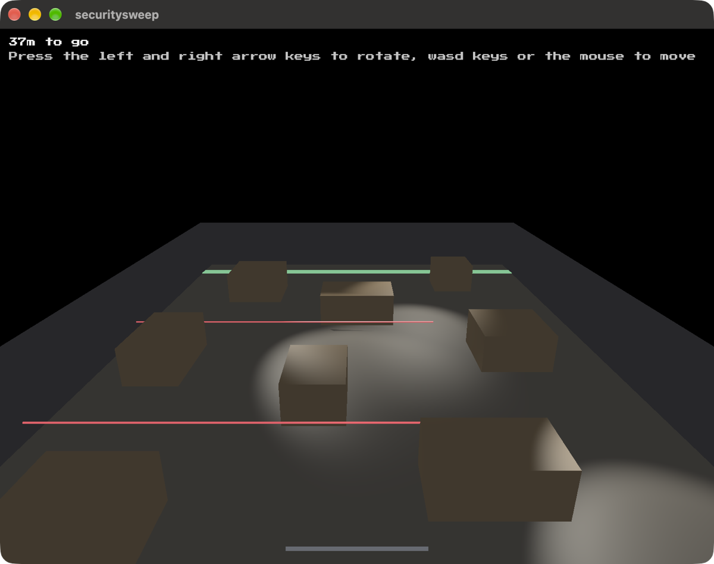

# securitysweep

An open yard with four spotlights sweeping across it



Walk across. Being lit fills a meter, the dark empties it slower than it fills,
and full puts you back at the near side. The crates stop the beams and stop you,
so what looks like shelter is shelter. Nothing chases you: the lights sweep the
same way whether you are there or not, and learning them is the game.

Built on [blitzkit](https://github.com/jvalol/blitzkit), the eighth game on that
engine, and the first to use its spot lights.

Being seen is three questions: in the cone, in range, and nothing in the way.
Those are `SpotLight::cone`, `SpotLight::falloff` and a ray against the crates,
all of which feed the shader too, so the losing condition can be checked without
a window and what the tests assert is what the screen draws.

```
cargo run
```

---

I asked AI to draft this for me. I've edited it. Any surviving AI smells are my oversight.
